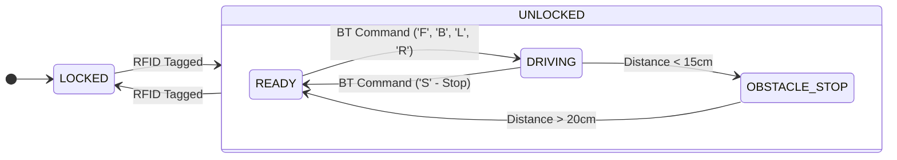

# STM32 Bare-Metal RC Car with RFID Security
Nucleo-F411RE 보드를 사용하여 OS 없이(Bare-Metal) 구현한 스마트 RC Car 프로젝트입니다.  
초음파 충돌 방지, Bluetooth 조종, RFID 시스템 활성화/비활성활 기능을 통합하여 실시간 제어 로직을 구현했습니다.

### 주요기능 
- 블루투스를 이용한 RC car 조종
- 초음파 센서를 활용한 전방 충돌 방지와 LED, Buzzer로 장애물 알림
- RFID를 사용하여 시스템 활성화/비활성화
- LED Display를 활용하여 현재 상황 동적으로 시각화.

## 하드웨어 설정

#### 사용한 부품
[4WD 주행로봇 프레임 세트](https://www.devicemart.co.kr/goods/view?no=1327455)  
[모터 제어 쉴드](https://www.devicemart.co.kr/goods/view?no=1278922)  
[초음파 센서](https://www.devicemart.co.kr/goods/view?no=1076851)  
[블루투스 모듈](https://www.devicemart.co.kr/goods/view?no=1278220)  
[LCD display](https://www.devicemart.co.kr/goods/view?no=1327456)  
[RFID 모듈](https://www.devicemart.co.kr/goods/view?no=1279308)  
[수동 부저](https://www.devicemart.co.kr/goods/view?no=2736)  

#### MX 설정

  
  
▲ MX Pinout View 설정
 

  

| 기능 (Role)      | 부품명 (Device)         | 통신 방식 (Interface) | Peripheral | 핀 정보 (Pin Out)                                   |
|------------------|-------------------------|------------------------|-----------|-----------------------------------------------------|
| 블루투스 통신   | HC-06 Bluetooth         | UART                   | USART6    | PA11 (TX), PA12 (RX)                                |
| RFID 보안  | RC522 RFID              | SPI                    | SPI2      | PB13 (SCK), PC2 (MISO), PC3 (MOSI), PC4 (CS), PC0 (RST) |
| LCD Display   | I2C LCD 1602            | I2C                    | I2C1      | PB8 (SCL), PB9 (SDA)                                |
| 초음파 센서    | HC-SR04 Ultrasonic      | Input Capture          | TIM5      | PC10 (Trig), PA1 (Echo)                         |
| 구동 (Actuator)  | DC Motor (L298N Driver) | PWM                    | TIM2,3    | PB10, PB4 (Left Motor), PA7, PB3 (Right Motor)      |

## 소프트웨어 아키텍처
해당 프로젝트는 실시간성이 중요한 제어와데이터 처리가 중요한 표시/인식 로직을 분리하여 설계했습니다.  

1. 인터럽트 방식(Event-Driven)  
- UART Rx Interrupt: 사용자의 조종 명령을 즉각적으로 수신하여 모터를 제어합니다.
- Timer Input Capture: 초음파 에코 신호의 길이를 us단위로 측정하여 장애물 거리를 계산합니다.

2. 폴링 방식(Main Loop)
- RFID Scanning: `while(1)` 루프에서 상시 태그를 확인합니다. 인식 시 시스템 상태를 토글합니다.
- LCD Update: 화면 업데이트로 인한 딜레이가 제어 로직을 방해하지 않도록 `HAL_GetTick()`을 활용하여 200ms 주기로 비동기 업데이트를 수행합니다.

### 상태 머신 다이어그램

## 구현 결과
#### 전체 사진

  
  
▲ 완성 사진
 

#### dc 모터 동작
블루투스로 휴대폰과 연결 후 앞뒤좌우 제어가능  

  <video src="https://github.com/user-attachments/assets/be2de103-9abc-4a54-82a2-ff46f334d08b" width="400" autoplay loop muted playsinline></video>

#### 초음파 센서 동작
전방 15cm 이내 장애물 발견 시 부저와 LED 점등 및 앞으로 전진 불가  

  <video src="https://github.com/user-attachments/assets/5459a48b-0e55-4206-a4b8-3175fe5060cc" width="400" autoplay loop playsinline></video>

#### RFID로 시스템 상태변화
RFID 카드 키로 시스템 활성화/비활성화 제어가능  
비활성화 시 초음파 센서, 블루투스로 RC CAR 제어 불가  

  <video src="https://github.com/user-attachments/assets/a33692b7-b417-4f48-9f69-d903df544c4d" width="400" autoplay loop muted playsinline></video>

#### LCD Display
현재 시스템 상태 및 전방 장애물간 거리 확인 가능  

  <video src="https://github.com/user-attachments/assets/32f078e4-d3de-4e94-a3a8-844cdca37bbd" width="400" autoplay loop muted playsinline></video>

